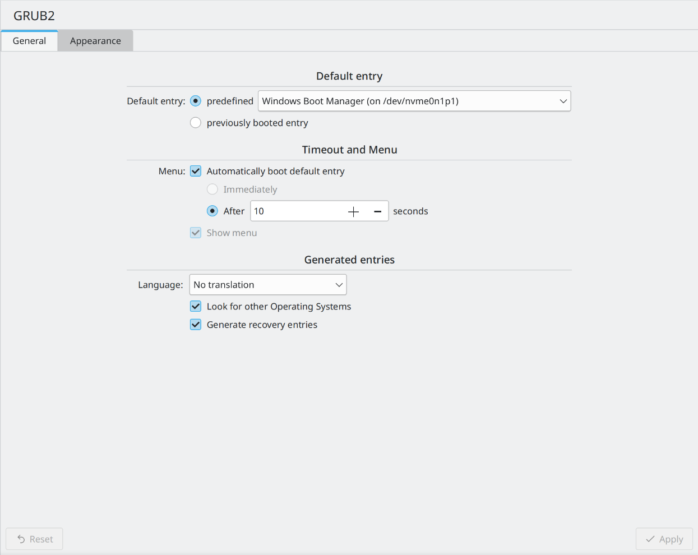

# kcm-grub

This is a KCM to edit grub configurations. This project does use a lot of code from [kcm-grub2](https://invent.kde.org/system/kcm-grub2). It only has basic features as of now which is expected to change as the time progresses. It is currently in beta state. Feel free to try it out.



It is written using c++ and qml.

Current features
- Manage default boot entry
- Manage boot timeout

## Build instructions
```
mkdir build

cd build

cmake ..

sudo make install

kcmshell5 kcm_grub
```